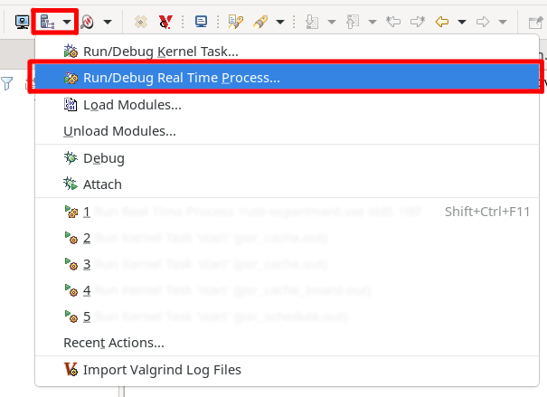
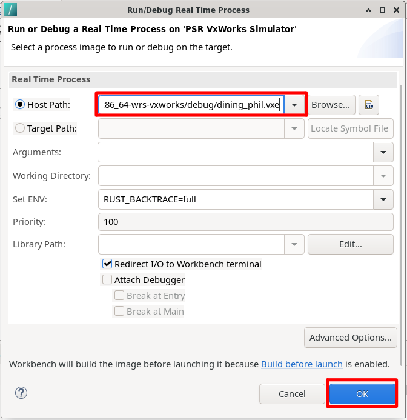

# First Rust project 

*This tutorial is largely based on [https://harmonicss.co.uk/vxworks/using-rust-with-vxworks-7/](https://harmonicss.co.uk/vxworks/using-rust-with-vxworks-7/) guide for windows machine.*

*Paths (which may include version numbers in directory names) used in this tutorial are taken from the university lab setup. Your paths/versions may differ.*

*This document assumes you have followed the previous [Installation - linux](installation-linux.md) guide, namely had set up your `.profile`*

---

## 1. Open a new terminal and navigate to your workspace

`cd ~/workspace`

## 2. Create and build the VxWorks Source Build (VSB) project

We will put all our Rust code later into VSB project. Multiple different rust applications may be built using one VSB. It is however compatible only with the simulator environment.

`vxprj vsb create rust\_vsb -bsp vxsim\_linux -smp -force -S`
`cd rust_vsb`
`make -j 8`

After the last step is done, return to your workspace `cd ~/workspace`

## 3. Create and build the basic VxWorks Image Project (VIP)

`vxprj create -smp vxsim\_linux rust\_vip -profile PROFILE\_DEVELOPMENT -vsb rust_vsb`
`cd rust_vip`
`vxprj vip bundle add BUNDLE_RUST // set VxWorks process pthread scheduling to the POSIX 1003.1 standard`
`vxprj vip component add INCLUDE_POSIX_PTHREAD_SCHEDULER`
`vxprj build`


## 4. Add your project to `~/.profile`

Append line `source ~/workspace/rust_vsb/usr/rust/rustenv.linux` to your profile file - `~/.profile`

Don't forget to manually source this to continue in the tutorial. Or close and re-open your terminal.

## 5. Create an example Rust application

We will create an example using dining philosophers problem.

Navigate to rust root of VSB: `cd ~/workspace/rust_vsb/usr/rust/`

`cargo new dining_phil`
`cd dining_phil/src`


Edit the `main.rs` file. Replace the contents with the following Rust source code:

```
use std::sync::{Arc, Mutex};
use std::thread;
struct Philosopher {
    name: String,
    left: usize,
    right: usize,
}
impl Philosopher {
    fn new(name: &str, left: usize, right: usize) -> Philosopher {
        Philosopher {
            name: name.to_string(),
            left: left,
            right: right,
        }
    }
    fn eat(&self, table: &Table) {
        let _left = table.forks[self.left].lock().unwrap();
        let _right = table.forks[self.right].lock().unwrap();
        println!("{} is eating.", self.name);
        thread::sleep_ms(1000);
        println!("{} is done eating.", self.name);
    }
}
struct Table {
    forks: Vec<Mutex<()>>,
}
fn main() {
    let table = Arc::new(Table {
        forks: vec![
            Mutex::new(()),
            Mutex::new(()),
            Mutex::new(()),
            Mutex::new(()),
            Mutex::new(()),
        ],
    });
    let philosophers = vec![
        Philosopher::new("Donald", 0, 1),
        Philosopher::new("Larry", 1, 2),
        Philosopher::new("Mark", 2, 3),
        Philosopher::new("John", 3, 4),
        Philosopher::new("Bruce", 0, 4),
    ];
    let handles: Vec<_> = philosophers
        .into_iter()
        .map(|p| {
            let table = table.clone();
            thread::spawn(move || {
                p.eat(&table);
            })
        })
        .collect();
    for h in handles {
        h.join().unwrap();
    }
}
```

## 6. Build it

Navigate to root of this application: `cd ~/workspace/rust_vsb/usr/rust/dining_phil`

`cargo build`

## 7a. Run it in terminal

Navigate to your image project `cd ~/workspace/rust_vip/default`

and run `vxsim`

new prompt will open. Type in `cmd` into this prompt. This will open another prompt.

There locate your application compile output: `cd ../../rust_vsb/usr/rust/dining_phil/target/x86_64-wrs-vxworks/debug`
And run it: `./dining_phil.vxe`


You should see output similar to this:
```
[vxWorks *]# ./dining_phil.vxe
Launching process './dining_phil.vxe' ...
Process './dining_phil.vxe' (process Id = 0x4001d6c30) launched.
Donald is eating.
Mark is eating.
Donald is done eating.
Mark is done eating.
Larry is eating.
Bruce is eating.
Larry is done eating.
Bruce is done eating.
John is eating.
John is done eating.
[vxWorks *]#
```

*Whenever you change your code, don't forget to rebuild it using as described in step 6.*

## 7b. Run it in WindRiver environment

Open your VSB project in the the WindRiver IDE

Locate "Target actions for selected connection" button (shown in the figure) and select "Run/Debug Real Time Process"



A new window will pop up. Fill in the field "Host path" with the path to the `.vxe` file (your compile output) - it will be located in `<project>/usr/rust/dining_phil/target/x86_64-wrs-vxworks/debug`




*Whenever you change your code, don't forget to rebuild it using as described in the step `6.`*


