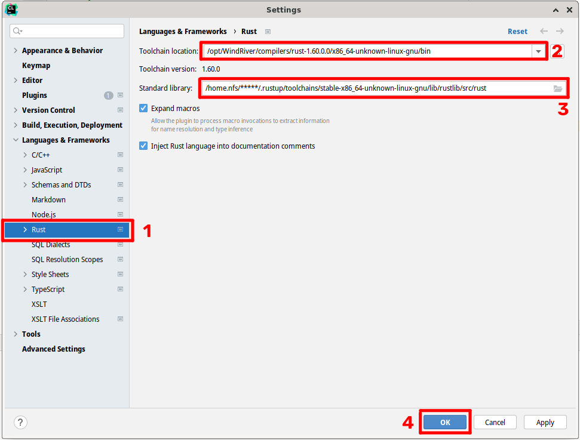

# Installation - linux

*Paths (which may include version numbers in directory names) used in this tutorial are taken from the university lab setup. Your paths/versions may differ.*

*Tested on machine: linux (Debian 5.10.46-4) - x86_64*

---

## 1. Rust

We will use rust installation that comes with VxWorks. There should be a toolchain located in `/opt/WindRiver/compilers/rust-1.60.0.0/x86_64-unknown-linux-gnu/bin` directory.

*Any other (system-wide) RUST installation shouldn't be necessary, however if for some reason it is, follow the standard RUST installation guide*

## 2. Environmental variables

VxWorks needs certain environment variables to run properly. Setting up these variables in terminal can be achieved by issuing command `/opt/WindRiver/wrenv.linux -p vxworks`.
However, in order to automate this, we can add the needed variables to the `~/.profile` file in order for them to get loaded whenever terminal is opened.

To analyze which variables are needed, you can extract variables from your current setup, before and after this command:

`env | sort > /tmp/before`
`/opt/WindRiver/wrenv.linux -p vxworks`
`env | sort > /tmp/after`
`diff /tmp/before /tmp/after`

You can see the changes by analysing the diff and then apply these changes in the form of `.profile` file.

You can also look into what these variables look like on my system, in file [profile](profile) and append this to your `~/.profile`. However please note that this can differ from your setup and you can accidentally break things. Take extra care when copy-pasting the contents of `PATH` variable. The previous method with `env` and `diff` is preferred.

*Once we prepare our project, we will need to add one more line to the `~/.profile` file; it is described in the following document.*

## 3. CLion setup (optional)

Install [CLion](https://www.jetbrains.com/clion/) using your favorite way and license.

Install [Rust plugin](https://plugins.jetbrains.com/plugin/8182-rust) for CLion.

## 4. Link CLion with VxWorks toolchain

Open settings (<kbd>⌃ Control</kbd> + <kbd>⌥ Alt</kbd> + <kbd>S</kbd>) as shown in figure:

Navigate to languages & frameworks > rust > cargo location and type in `/opt/WindRiver/compilers/rust-1.60.0.0/x86_64-unknown-linux-gnu/bin`

Standard library should get filled automatically, if not type in `/home.nfs/*****/.rustup/toolchains/stable-x86_64-unknown-linux-gnu/lib/rustlib/src/rust` (replace ***** with your username)

Save the settings using `OK` button.
 
## 5. CLion and .profile file

In order for the compilation in CLion to work properly, CLion needs access to the afforementioned environmental variables. There are several methods how to achieve this. One such method is launching CLion from terminal (with the profile already loaded). Different method is making a custom `.desktop` launcher pointing first to a script that will load `~/.profile` and then launch clion with this profile. You can decide what you prefer or use a different way altogether that works with your setup.
 

## 6. Next step

You are now ready for your [First Rust project](first-project.md) that runs in the simulator.

